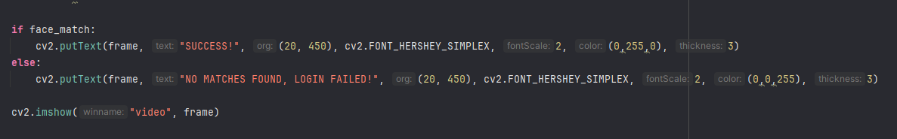

# Documentation Update 5.12.24 

Date:  May 5, 2024 

Features added / updated since the last update

Figuring out how to locate the source of my camera and utilizing cv2 library. I recall running into trial and conflicts as for some reason my IF statement wasn't running how I wanted to. I did some research on YOUTUBE and found a creator that did some explanation on what line does what. I honestly forgot what my inital if statement really looked like but the one im sharing now, works perfectly .. or i think. My no matches is queuing, prior to that it kept showing success on faces I did not place into my data. 

Issues that you ran into
To shorten, my video kept saying success intially which was not case as I was providing face feature that were not exported into my data.

Any lessons learned during this period
While trying to troubleshoot, i ran into a youtube video that explained the benefit of facial recognition in python. There so much ways to use facial recognition in an application. Also, OpenCV is commonly used in image processing. 
